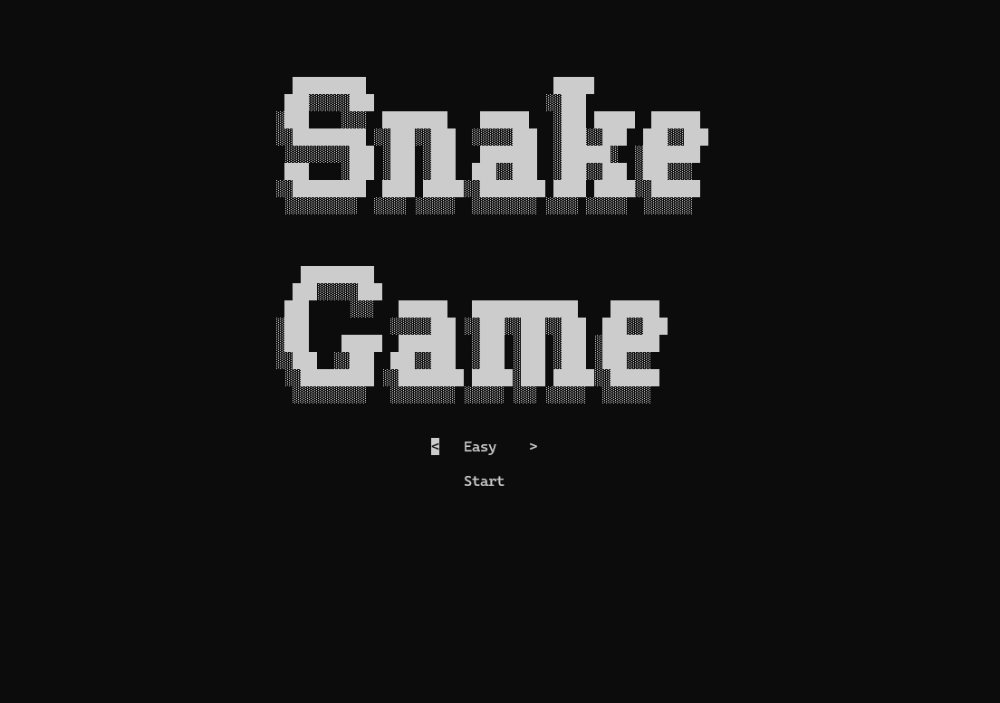
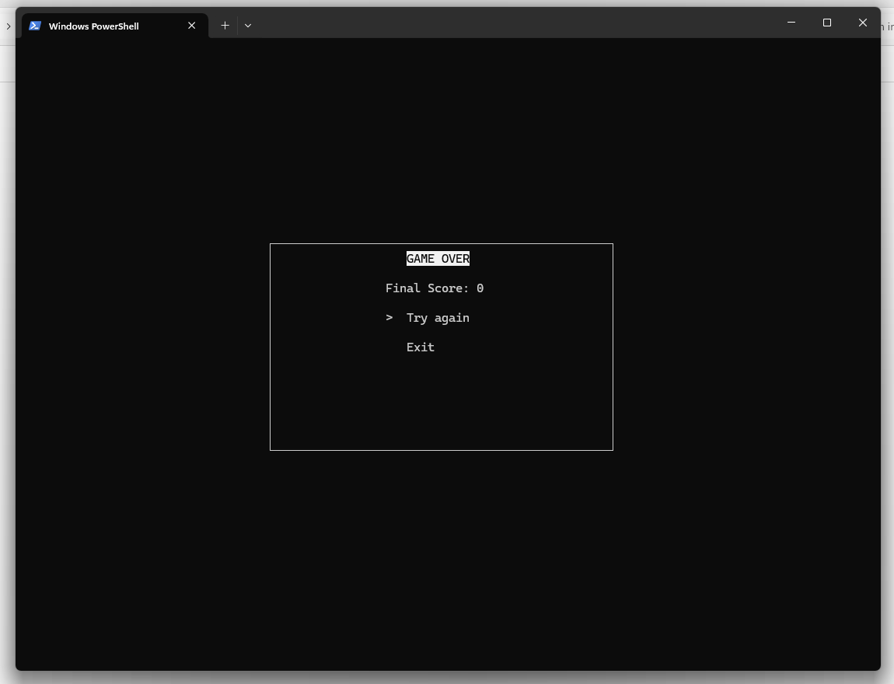
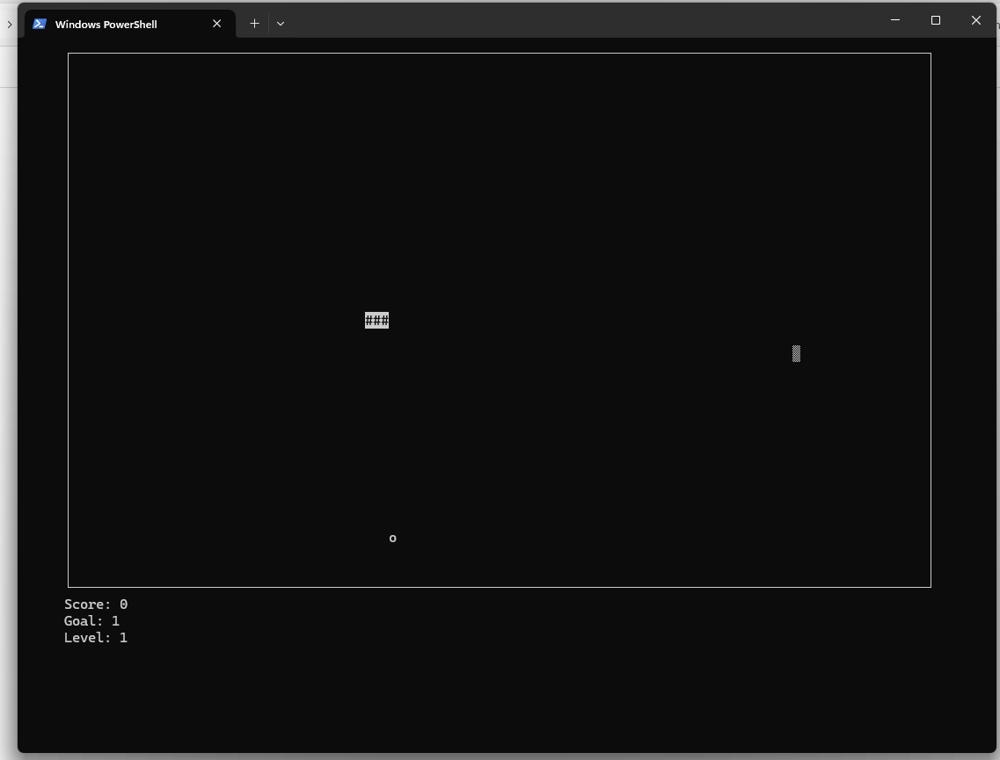

# Snake Game

This is a classic Snake game implemented in Python using the `curses` library. The game features multiple difficulty levels, obstacles, and a level progression system.

## Features

- **Multiple Difficulty Levels**: Easy, Medium, and Hard modes.
- **Obstacles**: Randomly generated obstacles that increase with each level.
- **Level Progression**: Complete levels by reaching score goals.
- **ASCII Art**: Displayed using the `pyfiglet` library.
- **Game Screens**: Start screen, game over screen, level up screen, and winner screen.

## Requirements

- Python 3.x
- `curses` library (pre-installed with Python on Unix-based systems)
- `pyfiglet` library

## Installation

1. Clone the repository:
    ```sh
    git clone https://github.com/yourusername/snake-game.git
    cd snake-game
    ```

2. Install the required Python package:
    ```sh
    pip install pyfiglet
    ```

## Usage

Run the game using the following command:
```sh
python snake.py
```

## Screenshots

### Start Screen


### Main Game Screen


### Game Over Screen


You can add the images to your 

README.md

 file by using the Markdown syntax for images. Here is the updated 

README.md

 file with the images included:

```markdown
# Snake Game

This is a classic Snake game implemented in Python using the `curses` library. The game features multiple difficulty levels, obstacles, and a level progression system.

## Features

- **Multiple Difficulty Levels**: Easy, Medium, and Hard modes.
- **Obstacles**: Randomly generated obstacles that increase with each level.
- **Level Progression**: Complete levels by reaching score goals.
- **ASCII Art**: Displayed using the `pyfiglet` library.
- **Game Screens**: Start screen, game over screen, level up screen, and winner screen.

## Requirements

- Python 3.x
- `curses` library (pre-installed with Python on Unix-based systems)
- `pyfiglet` library

## Installation

1. Clone the repository:
    ```sh
    git clone https://github.com/yourusername/snake-game.git
    cd snake-game
    ```

2. Install the required Python package:
    ```sh
    pip install pyfiglet
    ```

## Usage

Run the game using the following command:
```sh
python snake.py
```

## Game Screens

### Start Screen


### Main Screen


### Finish Screen


## Game Controls

- **Arrow Keys**: Control the direction of the snake.
- **Enter Key**: Select options on the game screens.

## Game Screens

### Start Screen

- Choose the game mode (Easy, Medium, Hard).
- Start the game.

### Game Over Screen

- Display the final score.
- Option to retry or exit the game.

### Level Up Screen

- Display the completed level.
- Prompt to continue to the next level.

### Winner Screen

- Display a congratulatory message upon completing all levels.

## Code Overview

### Main Function

The `main` function initializes the game screen, sets up the game loop, and handles the game logic including snake movement, collision detection, food generation, score tracking, and level progression.

### Functions

- `create_food(snake, obstacles, screen_height, screen_width)`: Generates a random food position.
- `create_obstacles(level, screen_height, screen_width)`: Generates a list of obstacle positions.
- `draw_ascii_art(stdscr, text)`: Draws ASCII art text on the screen.
- `draw_border(stdscr, top, left, width, height)`: Draws a border on the screen.
- `game_winner_screen(stdscr, screen_height, screen_width)`: Displays the winner screen.
- `game_start_screen(stdscr)`: Displays the start screen.
- `game_over_screen(stdscr, score)`: Displays the game over screen.
- `level_up_screen(stdscr, level, screen_height, screen_width)`: Displays the level up screen.

## License

This project is licensed under the MIT License.
```